# Deploy

An Elixir tool that automates the deployment workflow using Ash Reactor for saga orchestration.

## Setup

```bash
# Install dependencies
mix setup

# Set required environment variables
export DEPLOY_REPO_URL="https://github.com/yourorg/yourrepo.git"
export GITHUB_TOKEN="ghp_xxxx"
```

## Usage

### Mix Task

The primary interface is the `mix deploy` task:

```bash
# Deploy specific PRs
mix deploy 12 13

# Deploy with all validation skipped (for testing)
mix deploy 12 13 --skip-validation

# Skip specific checks
mix deploy 12 13 --skip-reviews --skip-ci

# Resume a failed deploy
mix deploy 12 13 --resume

# Force restart (delete existing branch and start fresh)
mix deploy 12 13 --force

# Request review from specific users
mix deploy 12 13 --reviewers alice,bob
```

### Options

| Option | Description |
|--------|-------------|
| `--skip-reviews` | Skip approval validation |
| `--skip-ci` | Skip CI validation |
| `--skip-conflicts` | Skip merge conflict validation |
| `--skip-validation` | Skip all validation checks |
| `--reviewers USER,USER` | Comma-separated list of reviewers |
| `--resume` | Resume from existing deploy branch state |
| `--force` | Delete existing deploy branch and start fresh |

### Programmatic API

```elixir
# Full deployment
Deploy.Runner.deploy_pr(
  pr_numbers: [12, 13],
  reviewers: ["alice", "bob"],
  skip_validation: true
)

# Just setup phase
Deploy.Runner.setup()

# Just merge phase
Deploy.Runner.merge_prs(pr_numbers: [12, 13])

# Check deploy state
Deploy.Runner.check_deploy_state()
```

## Validation

Before merging PRs, the tool validates:

1. **Approval** - At least one approved review, no outstanding change requests
2. **CI Status** - All checks completed successfully
3. **Merge Conflicts** - PR is mergeable (checked before each merge)

Validation can be skipped individually or entirely using the skip options.

## Workflow Diagram

```mermaid
flowchart LR
    start{"Start"}
    start==>reactor_Deploy.Reactors.FullDeploy
    subgraph reactor_Deploy.Reactors.FullDeploy["Deploy.Reactors.FullDeploy"]
        direction LR
        input_58213234>"Input repo_url"]
        input_78897456>"Input github_token"]
        input_66160555>"Input deploy_date"]
        input_74327903>"Input client"]
        input_107770752>"Input owner"]
        input_70237582>"Input repo"]
        input_115931486>"Input pr_numbers"]
        input_11250747>"Input skip_reviews"]
        input_6260569>"Input skip_ci"]
        input_131108254>"Input skip_conflicts"]
        input_12711955>"Input skip_validation"]
        input_67647111>"Input reviewers"]
        step_62183991 -->|workspace|step_61371111
        step_62183991 -->|deploy_branch|step_61371111
        step_80898151 -->|merged_prs|step_61371111
        input_74327903 -->|client|step_61371111
        input_107770752 -->|owner|step_61371111
        input_70237582 -->|repo|step_61371111
        input_67647111 -->|reviewers|step_61371111
        step_61371111["deploy_pr(Reactor.Step.Compose)"]
        subgraph reactor_23000827["{Deploy.Reactors.DeployPR, :deploy_pr}"]
            direction LR
            input_71500793>"Input workspace"]
            input_123685228>"Input deploy_branch"]
            input_113592922>"Input merged_prs"]
            input_106513218>"Input client"]
            input_124633091>"Input owner"]
            input_116056035>"Input repo"]
            input_37553250>"Input reviewers"]
            input_106513218 -->|client|step_36557890
            input_124633091 -->|owner|step_36557890
            input_116056035 -->|repo|step_36557890
            step_37692558 -->|pr_number|step_36557890
            input_37553250 -->|reviewers|step_36557890
            step_36557890["request_review(Deploy.Reactors.Steps.RequestReview)"]
            input_106513218 -->|client|step_119348716
            input_124633091 -->|owner|step_119348716
            input_116056035 -->|repo|step_119348716
            step_37692558 -->|pr_number|step_119348716
            input_113592922 -->|merged_prs|step_119348716
            input_123685228 -->|deploy_branch|step_119348716
            step_119348716["update_pr_description(Deploy.Reactors.Steps.UpdatePRDescription)"]
            input_106513218 -->|client|step_37692558
            input_124633091 -->|owner|step_37692558
            input_116056035 -->|repo|step_37692558
            input_123685228 -->|deploy_branch|step_37692558
            step_85559857 -->|_|step_37692558
            step_37692558["create_deploy_pr(Deploy.Reactors.Steps.CreateDeployPR)"]
            input_71500793 -->|workspace|step_85559857
            input_123685228 -->|deploy_branch|step_85559857
            step_87472692 -->|_|step_85559857
            step_85559857["push_version_bump(Deploy.Reactors.Steps.PushVersionBump)"]
            input_71500793 -->|workspace|step_87472692
            step_129849650 -->|new_version|step_87472692
            step_87472692["commit_version_bump(Deploy.Reactors.Steps.CommitVersionBump)"]
            input_71500793 -->|workspace|step_129849650
            step_129849650["bump_version_files(Deploy.Reactors.Steps.BumpVersionFiles)"]
            return_23000827{"Return"}
            step_37692558==>return_23000827
        end
        step_61371111-->input_37553250
        step_61371111-->input_116056035
        step_61371111-->input_124633091
        step_61371111-->input_106513218
        step_61371111-->input_113592922
        step_61371111-->input_123685228
        step_61371111-->input_71500793
        return_23000827-->step_61371111
        step_62183991 -->|deploy_branch|step_80898151
        step_62183991 -->|workspace|step_80898151
        input_74327903 -->|client|step_80898151
        input_107770752 -->|owner|step_80898151
        input_70237582 -->|repo|step_80898151
        input_115931486 -->|pr_numbers|step_80898151
        input_11250747 -->|skip_reviews|step_80898151
        input_6260569 -->|skip_ci|step_80898151
        input_131108254 -->|skip_conflicts|step_80898151
        input_12711955 -->|skip_validation|step_80898151
        step_80898151["merge_prs(Reactor.Step.Compose)"]
        subgraph reactor_16329972["{Deploy.Reactors.MergePRs, :merge_prs}"]
            direction LR
            input_3002690>"Input deploy_branch"]
            input_92099616>"Input workspace"]
            input_56908002>"Input client"]
            input_9023921>"Input owner"]
            input_85373760>"Input repo"]
            input_25612832>"Input pr_numbers"]
            input_113055805>"Input skip_reviews"]
            input_31440810>"Input skip_ci"]
            input_53932534>"Input skip_conflicts"]
            input_118271472>"Input skip_validation"]
            input_92099616 -->|workspace|step_127606119
            input_3002690 -->|deploy_branch|step_127606119
            step_94231673 -->|_|step_127606119
            step_127606119["update_local_branch(Deploy.Reactors.Steps.UpdateLocalBranch)"]
            input_56908002 -->|client|step_104857500
            input_9023921 -->|owner|step_104857500
            input_85373760 -->|repo|step_104857500
            step_97111622 -->|prs|step_104857500
            input_3002690 -->|deploy_branch|step_104857500
            step_104857500["change_pr_bases(Deploy.Reactors.Steps.ChangePRBases)"]
            input_56908002 -->|client|step_97111622
            input_9023921 -->|owner|step_97111622
            input_85373760 -->|repo|step_97111622
            step_97176700 -->|prs|step_97111622
            input_113055805 -->|skip_reviews|step_97111622
            input_31440810 -->|skip_ci|step_97111622
            input_118271472 -->|skip_validation|step_97111622
            step_97111622["validate_prs(Deploy.Reactors.Steps.ValidatePRs)"]
            input_56908002 -->|client|step_97176700
            input_9023921 -->|owner|step_97176700
            input_85373760 -->|repo|step_97176700
            input_25612832 -->|pr_numbers|step_97176700
            step_97176700["fetch_approved_prs(Deploy.Reactors.Steps.FetchApprovedPRs)"]
            input_56908002 -->|client|step_94231673
            input_9023921 -->|owner|step_94231673
            input_85373760 -->|repo|step_94231673
            step_104857500 -->|prs|step_94231673
            input_53932534 -->|skip_conflicts|step_94231673
            step_94231673["merge_prs(Deploy.Reactors.Steps.MergePRs)"]
            return_16329972{"Return"}
            step_94231673==>return_16329972
        end
        step_80898151-->input_118271472
        step_80898151-->input_53932534
        step_80898151-->input_31440810
        step_80898151-->input_113055805
        step_80898151-->input_25612832
        step_80898151-->input_85373760
        step_80898151-->input_9023921
        step_80898151-->input_56908002
        step_80898151-->input_92099616
        step_80898151-->input_3002690
        return_16329972-->step_80898151
        input_58213234 -->|repo_url|step_62183991
        input_78897456 -->|github_token|step_62183991
        input_66160555 -->|deploy_date|step_62183991
        step_62183991["setup(Reactor.Step.Compose)"]
        subgraph reactor_8222009["{Deploy.Reactors.Setup, :setup}"]
            direction LR
            input_24745846>"Input repo_url"]
            input_72918134>"Input github_token"]
            input_68386442>"Input deploy_date"]
            step_14035138 -->|branch|step_3803589
            step_92805257 -->|workspace|step_3803589
            step_3803589["setup_result(Deploy.Reactors.Steps.ReturnMap)"]
            step_92805257 -->|workspace|step_14035138
            step_66403298 -->|branch|step_14035138
            step_66403298 -->|_|step_14035138
            step_14035138["push_deploy_branch(Deploy.Reactors.Steps.GitPush)"]
            step_92805257 -->|workspace|step_66403298
            input_68386442 -->|deploy_date|step_66403298
            value_staging{{"`&quot;staging&quot;`"}}
            value_staging -->|base_branch|step_66403298
            step_82866582 -->|_|step_66403298
            step_66403298["create_deploy_branch(Deploy.Reactors.Steps.CreateDeployBranch)"]
            step_92805257 -->|workspace|step_82866582
            value_staging{{"`&quot;staging&quot;`"}}
            value_staging -->|branch|step_82866582
            step_42996146 -->|_|step_82866582
            step_82866582["fetch_staging(Deploy.Reactors.Steps.GitFetch)"]
            step_92805257 -->|workspace|step_42996146
            input_24745846 -->|repo_url|step_42996146
            input_72918134 -->|github_token|step_42996146
            step_42996146["clone_repo(Deploy.Reactors.Steps.CloneRepo)"]
            step_92805257["create_workspace(Deploy.Reactors.Steps.CreateWorkspace)"]
            return_8222009{"Return"}
            step_3803589==>return_8222009
        end
        step_62183991-->input_68386442
        step_62183991-->input_72918134
        step_62183991-->input_24745846
        return_8222009-->step_62183991
        step_62183991 -->|branch|step_44905824
        step_62183991 -->|workspace|step_44905824
        step_80898151 -->|merged_prs|step_44905824
        step_61371111 -->|pr_number|step_44905824
        step_61371111 -->|pr_url|step_44905824
        step_44905824["result(Deploy.Reactors.Steps.ReturnMap)"]
        return_Deploy.Reactors.FullDeploy{"Return"}
        step_44905824==>return_Deploy.Reactors.FullDeploy
    end
```

<!-- MERMAID_DIAGRAM_START -->

<!-- MERMAID_DIAGRAM_END -->

To regenerate the diagram after changes:

```bash
mix deploy.mermaid --expand --readme
```

Other output options:

```bash
# Generate to file
mix deploy.mermaid --expand --output workflow.mmd

# Output to terminal for copy-paste
mix deploy.mermaid --expand --format copy

# Generate URL for Mermaid Live Editor
mix deploy.mermaid --expand --format url
```

## Testing

```bash
mix test
```
